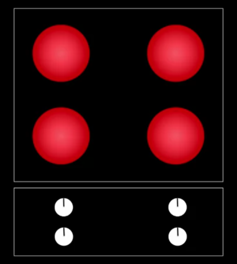
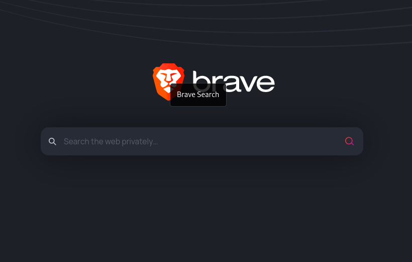

<!-- START doctoc generated TOC please keep comment here to allow auto update -->
<!-- DON'T EDIT THIS SECTION, INSTEAD RE-RUN doctoc TO UPDATE -->
**Table of Contents**  *generated with [DocToc](https://github.com/thlorenz/doctoc)*

- [What is Human Computer Interaction?](#what-is-human-computer-interaction)
  - [Usability](#usability)
    - [Measuring Usability](#measuring-usability)
    - [How do we measure Usability?](#how-do-we-measure-usability)
  - [Tasks and Task analysis](#tasks-and-task-analysis)
    - [Common errors in task creation](#common-errors-in-task-creation)
  - [Chunking Information](#chunking-information)
  - [Mental Models](#mental-models)

<!-- END doctoc generated TOC please keep comment here to allow auto update -->

# What is Human Computer Interaction?

  "HCI is a study of how humans interact with the computers."

- It is important to keep in mind how humans interact with the machines.
- Cybersecurity experts, designers etc. should always consider HCI element as the major proponent for design and security infrastructure.
- HCI involves knowing the users, tasks, context of the tasks.
- Evaluation of how easy/difficult it is to use the system.

## Usability

  "It is measure of how easy it is to use a system for a user."

### Measuring Usability

- Speed

  How quickly can the task be accomplished.

- Efficiency

  How many mistakes are made in accomplishing the task.

- Learnability

  How easy is it to learn to use the system.

- Memorability

  Once learned, how easy is it to remember how to use the system.

- User Preference

  What do users like?

### How do we measure Usability?

- Speed - timing
- Efficiency - counting error
- Learnability, Memorability and User Preference don't have straight forward measurement tools.

## Tasks and Task analysis

  "Tasks are goals that users have when interacting with the system."

### Common errors in task creation

- Leading or too descriptive
  > Click on the username box at the upper right of the screen and enter your username, then click on the password box underneath and enter your password. Click submit...

- Specific questions?
  > What is the third headline on CNN.com?

- Directing users towards things you want to tell them, not what they want to know.
  > What are the names of the members of the website security team?

## Chunking Information

  "Breaking a long list of pieces of information into smaller groups."
  "Aggregating several pieces of information into coherent groups to make them easier to remember."

- When designing systems, most important thing to consider is human memory, as it is very volatile.
- Working memory's limitations should be kept in mind.
- For design technology products, we should not expect user to remember more than 3 things at a time in his/her working memory.

## Mental Models

Number of factors affecting mental models;

- Affordance

  + Mapping
  
     

  + Visibility

     

  + Feedback

    User sees some visual change when they click a button.

  + Constraints

    User should not be allowed to perform a task until certain conditions are met.

  + Conventions

    There are some conventions in place, for cross culture usability.
